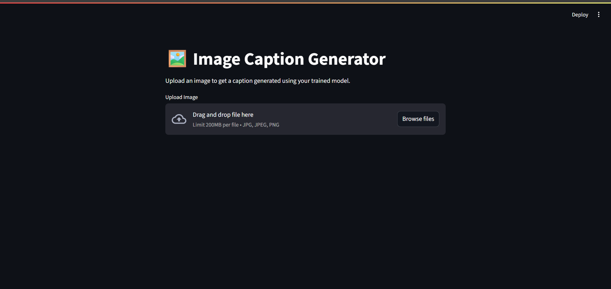
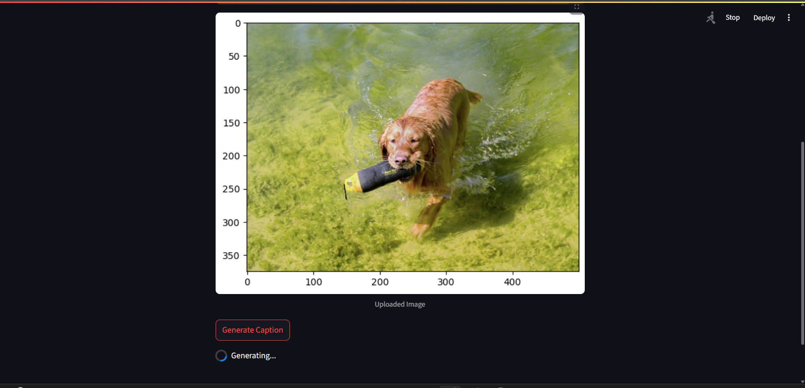
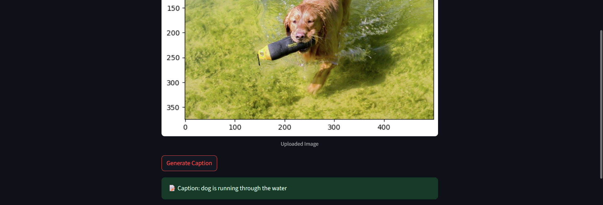

# Image Caption Generator

## Overview

This project implements an image caption generator using a deep learning model. The model is trained to generate descriptive captions for images, combining computer vision and natural language processing techniques.

## Table of Contents

- [Overview](#overview)
- [Features](#features)
- [Dependencies](#dependencies)
- [Model Architecture](#model-architecture)
- [Dataset](#dataset)
- [Training](#training)
- [Results](#results)

## Features

- **Image Captioning**: The model generates human-like captions for input images.
- **Transfer Learning**: Utilizes pre-trained convolutional neural networks (CNN) for feature extraction.
- **LSTM Networks**: Employs Long Short-Term Memory networks for sequence generation.

## Dependencies

- Python 3.x
- TensorFlow
- Keras
- NumPy
- Pillow (PIL)

Install the required dependencies using:

```bash
pip install -r requirements.txt
```

## Model Architecture

The image caption generator utilizes a combination of a pre-trained CNN for feature extraction and LSTM networks for sequence generation.
To define the structure of the model, we will be using the Keras Model from Functional API. It will consist of three major parts:

Feature Extractor – The feature extracted from the image has a size of 2048, with a dense layer, we will reduce the dimensions to 256 nodes.
Sequence Processor – An embedding layer will handle the textual input, followed by the LSTM layer.
Decoder – By merging the output from the above two layers, we will process by the dense layer to make the final prediction. The final layer will contain the number of nodes equal to our vocabulary size.


## Dataset

The model was trained on the [Flicker8K Dataset](#) which consists of images paired with human-generated captions.

## Training

To train the model, follow the steps outlined in `train_model.ipynb`. The notebook covers data preprocessing, model training, and evaluation.

## Results

Sample results are displayed in four images along with their model generated captions.




